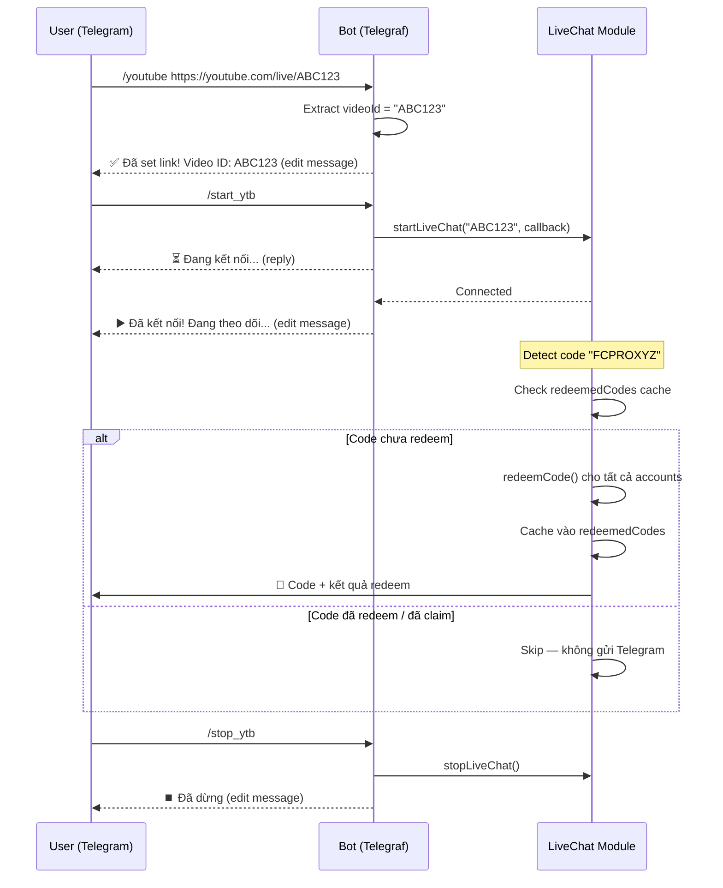

# Telegram Bot Commands cho YTB_FCO

Chuyển project từ script chạy hardcoded sang Telegram Bot dùng **Telegraf**, điều khiển qua commands và kết nối Supabase động.

## Proposed Changes

### Cấu trúc file mới

```
YTB_FCO/
├── .env             # [NEW] Biến môi trường (credentials, Supabase keys)
├── .env.example     # [NEW] Template .env cho người khác
├── db.js            # [NEW] Module kết nối và truy vấn Supabase
├── config.js        # [NEW] Cấu hình tập trung (đọc từ .env, không chứa ACCOUNTS tĩnh)
├── livechat.js      # [NEW] YouTube LiveChat logic + redeem cache (query DB động)
├── bot.js           # [NEW] Telegraf bot + commands (/set, /youtube, /start_ytb...)
├── index.js         # [MODIFY] Entry point, khởi tạo bot
├── package.json     # [MODIFY] Thêm dependency telegraf, dotenv, @supabase/supabase-js
├── .gitignore       # [MODIFY] Thêm .env, .codegraph
└── ...
```

---

### [NEW] [.env](file:///d:/Workspace/YTB_FCO/.env) / [.env.example](file:///d:/Workspace/YTB_FCO/.env.example)

Credentials Telegram và Supabase đưa ra environment variables:
```
TELEGRAM_BOT_TOKEN=your_token
TELEGRAM_CHAT_ID=your_chat_id
SUPABASE_URL=your_supabase_project_url
SUPABASE_ANON_KEY=your_supabase_anon_key
```
- `.env` chứa giá trị thật → đã thêm vào `.gitignore`
- `.env.example` chứa placeholder → commit vào repo

---

### [NEW] [db.js](file:///d:/Workspace/YTB_FCO/db.js)

Quản lý kết nối và truy vấn bảng `accounts` trên Supabase:
- **`getAccounts()`**: Query lấy tất cả tài khoản gồm `{ name, csrf, session }` đang có hiệu lực.
- **`upsertAccount(name, csrf, session)`**: Insert mới hoặc Update token nếu trùng `name` (unique).

#### Database Schema (SQL)
```sql
create table public.accounts (
  name text not null primary key,
  csrf text not null,
  session text not null,
  updated_at timestamp with time zone default timezone('utc'::text, now()) not null
);
```

---

### [NEW] [config.js](file:///d:/Workspace/YTB_FCO/config.js)

Dùng `dotenv` để load `.env`, export cấu hình:
- `TELEGRAM_BOT_TOKEN`, `TELEGRAM_CHAT_ID` — đọc từ `process.env`
- `THRESHOLD`, `RESET_INTERVAL` (3 phút), `CODE_REGEX`
- *(Loại bỏ mảng tĩnh `ACCOUNTS` để chuyển sang Supabase)*

---

### [NEW] [livechat.js](file:///d:/Workspace/YTB_FCO/livechat.js)

Module quản lý YouTube LiveChat, export các function:

- **`startLiveChat(videoId)`** — Tạo instance `LiveChat`, listen event `chat`, đếm code, tự gọi `triggerNotification(code)` khi đủ threshold.
- **`stopLiveChat()`** — Dừng LiveChat hiện tại, clear reset timer.
- **State management**:
  - `codeCounter`, `confirmedCodes` — reset sạch mỗi lần `startLiveChat`
  - `redeemedCodes` — **KHÔNG reset** khi start/stop, cache code đã redeem thành công suốt session
- Giữ nguyên logic skip batch cũ, code regex, threshold counting.

#### Redeem Cache Logic

Trong `triggerNotification(code)`:
1. **Trước khi redeem**: check `redeemedCodes` → nếu có thì skip hoàn toàn
2. **Sau khi redeem**: kiểm tra kết quả từng account:
   - `anySuccess` = có ít nhất 1 account redeem thành công
   - `allAlreadyClaimed` = tất cả account đều trả về "đã dùng"
3. **Cache**: nếu `anySuccess || allAlreadyClaimed` → thêm vào `redeemedCodes`
4. **Skip Telegram**: nếu tất cả account đã claim rồi → không gửi notification

> [!NOTE]
> Phát hiện "đã claim" qua response API: kiểm tra `result.msg` chứa "already", "claimed", "used", "redeemed" hoặc message tiếng Việt tương ứng.

> [!TIP]
> **Xử lý an toàn Response lỗi (Không phải JSON)**: Tích hợp kiểm tra `content-type` trong `redeemCode`. Nếu Garena trả về HTML (ví dụ phiên đăng nhập hết hạn hoặc Cloudflare chặn), hệ thống sẽ không cố đọc JSON để tránh lỗi cú pháp `Unexpected token`, thay vào đó sẽ nhận dạng và thông báo lỗi hết hạn hoặc mã trạng thái HTTP rõ ràng.

---

### [NEW] [bot.js](file:///d:/Workspace/YTB_FCO/bot.js)

Telegraf bot với 7 commands:

#### `/set [account_name] [cURL_command]`
1. Nhận tên gợi nhớ `account_name` (ví dụ: `huytq1998`) và phần còn lại chứa lệnh cURL.
2. Trích xuất `csrftoken` và `sessionid` từ cURL bằng Regex:
   - Header `X-CSRFToken` hoặc cookie `csrftoken=`
   - Cookie `sessionid=`
3. Gọi `upsertAccount(account_name, csrf, session)` để ghi đè vào Supabase.
4. Edit message báo thành công hoặc thất bại.

#### `/youtube [link]`
1. Nhận link YouTube (hỗ trợ các format: `youtube.com/watch?v=`, `youtube.com/live/`, `youtu.be/`)
2. Trích xuất Video ID bằng regex
3. Lưu vào biến `currentVideoId` (ghi đè nếu đã có)
4. Reply bằng `ctx.reply(...)` trước, rồi `ctx.editMessageText(...)` để update nội dung — **edit message thay vì gửi mới**
5. Nếu link không hợp lệ → edit message báo lỗi

#### `/start_ytb`
1. Kiểm tra `currentVideoId` đã set chưa → nếu chưa, edit message báo cần `/youtube` trước
2. Nếu đang chạy LiveChat → edit message báo đang chạy rồi
3. Gọi `startLiveChat(currentVideoId)`
4. Edit message xác nhận: "▶️ Đang theo dõi: {videoId}"

#### `/stop_ytb`
1. Kiểm tra có đang chạy LiveChat không → nếu không, edit message báo chưa chạy
2. Gọi `stopLiveChat()`
3. Edit message xác nhận: "⏹️ Đã dừng theo dõi"

#### `/status`
- Hiển thị trạng thái hiện tại (video ID đang set, đang chạy hay dừng, số code đã phát hiện, số code đang chờ)

#### `/coupon [code] [account_name]`
- Nạp coupon thủ công. 
- Nhận mã coupon bắt buộc `code` (luôn là tham số đầu tiên).
- Nhận tham số tùy chọn `account_name` ở vị trí thứ hai.
- Nếu không có `account_name` -> nạp cho tất cả các tài khoản đang lưu ở Supabase.
- Nếu có `account_name` -> chỉ nạp duy nhất cho tài khoản được chỉ định.
- Trả về kết quả HTML chi tiết, thân thiện, tự động escape ký tự HTML bằng helper `escapeHTML`.

#### `/accounts`
- Lấy toàn bộ tài khoản từ Supabase.
- Hiển thị danh sách đánh số trực quan, che bớt (masking) token CSRF/Session chỉ giữ lại 8 ký tự đầu để đảm bảo an toàn thông tin.

**Reply flow (edit message)**:
```
User: /start_ytb
Bot reply: "⏳ Đang kết nối..."          ← ctx.reply() gửi message đầu
Bot edit:  "▶️ Đã kết nối thành công!"   ← ctx.telegram.editMessageText() update
```

---

### [MODIFY] [index.js](file:///d:/Workspace/YTB_FCO/index.js)

Chuyển thành entry point đơn giản:
```js
const { bot } = require('./bot');
bot.launch();
process.once('SIGINT', () => bot.stop('SIGINT'));
process.once('SIGTERM', () => bot.stop('SIGTERM'));
```

---

### [MODIFY] [package.json](file:///d:/Workspace/YTB_FCO/package.json)

Thêm dependencies:
```json
"dependencies": {
    "@supabase/supabase-js": "^2.x",
    "dotenv": "^16.x",
    "telegraf": "^4.16.3",
    "youtube-chat": "^2.2.0"
}
```

Thêm script:
```json
"scripts": {
    "start": "node index.js",
    "test": "echo \"Error: no test specified\" && exit 1"
}
```

---

## Command Flow Summary



## Verification Plan

### Automated Tests
```bash
npm install
node index.js
```
- Gửi `/youtube https://www.youtube.com/live/testid` → bot reply + edit xác nhận Video ID
- Gửi `/start_ytb` → bot reply "đang kết nối" rồi edit kết quả
- Gửi `/stop_ytb` → bot edit xác nhận dừng
- Gửi `/status` -> hiển thị trạng thái động của bot
- Gửi `/accounts` -> trả về danh sách tài khoản che bớt token
- Gửi `/coupon CODETEST` -> nạp đồng loạt cho các account và trả về HTML
- Gửi `/coupon CODETEST huytq1998` -> nạp chỉ cho account huytq1998

### Manual Verification
- Test trực tiếp trên Telegram chat với bot
